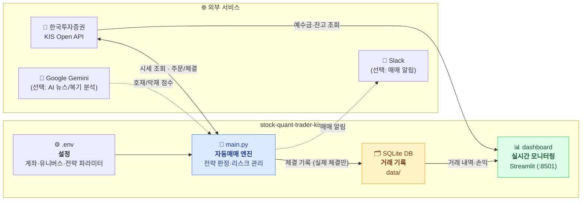
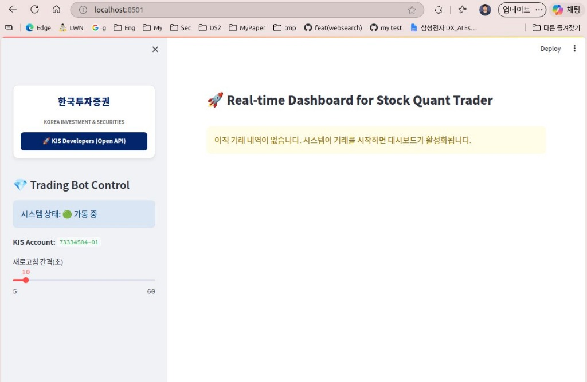
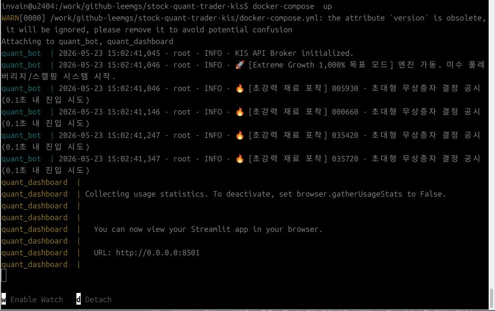

# KIS-based Stock Quant Trader (Korea Investment KIS API 🚀)

> 🎯 **목표: "지정한 금액으로 지정한 기간 동안 운영 후, 지정한 금액의 수익을 실현하기 위한 시스템입니다."**
>
> **한국투자증권 KIS API 기반 크로스플랫폼(Ubuntu/Windows/macOS) 자동매매 프레임워크**
>
> 🌐 **공식 가이드 웹사이트**: [docs/index.html](docs/index.html) · 📊 **실시간 시장국면**: [docs/regime.html](docs/regime.html)

---

## 🧩 한눈에 보기

**`.env` 파일 하나로 설정**하고 봇을 켜면, 매매 엔진이 KIS API로 시세를 감시·주문하고, 그 기록을 대시보드로 실시간 확인하는 구조입니다.



| 구성 요소 | 역할 | 한 줄 설명 |
|---|---|---|
| [`main.py`](./main.py) | 🚀 **진입점** | `.env` 설정을 읽어 매매 봇 전체를 가동 |
| [`src/strategies/`](./src/strategies) | 📈 **전략 엔진** | 변동성 돌파 + 스마트 모멘텀(Extreme Growth) 진입/청산 판정 |
| [`src/broker/`](./src/broker) | 🏦 **KIS 연동** | REST 시세 조회·주문 집행, 호출 간격 스로틀링(rate limit 보호) |
| [`src/monitor/dashboard.py`](./src/monitor/dashboard.py) | 📊 **대시보드** | 자산·손익·시스템 로그를 웹으로 실시간 시각화 |
| [`src/analytics/`](./src/analytics), [`src/backtester/`](./src/backtester) | 🧪 **분석/백테스트** | 성과 리포트, 슬리피지 분석, 유전 알고리즘 파라미터 최적화 |
| `data/` | 🗂️ **런타임 데이터** | 거래 기록 SQLite DB, 잔고 캐시 (git 미추적) |
| [`.env`](./.env.sample) | ⚙️ **설정** | 계좌·API 키·감시 종목·손절/익절 등 모든 운영 설정 |

---

## 📚 문서 (Documentation)

README를 간결하게 유지하기 위해 상세 내용은 [`documents/`](./documents) 폴더로 분리했습니다.

| 문서 | 내용 |
| :--- | :--- |
| 🛠️ [설치 및 실행 가이드](./documents/installation-and-run.md) | 설치 · `.env` 세팅 · 실행 옵션(Python/Docker/systemd) · 대시보드 · 문제 해결 |
| ☁️ [**무료 Open Cloud VM 운영 가이드**](./documents/free-oracle-cloud-vm.md) | **Oracle Cloud Always-Free 등 무료 VM에서 24시간 상시 운영하기** |
| 💡 [환경 변수 상세 (.env)](./documents/environment-variables.md) | 모든 환경 변수의 역할 · 기본값 · 권장 세팅 표 |
| 🏗️ [시스템 아키텍처 & 동작 원리](./documents/architecture.md) | 증권사 비교 · 아키텍처/동작 흐름 다이어그램 · 핵심 모듈 · 탑재 전략 |
| 📖 [자동매매 운영 가이드](./documents/operation-guide.md) | 매매 시간 · 전략 변경 · 모니터링 · 실전 전환 주의 · 리포트 샘플 |
| 🚀 [고수익 달성 로드맵](./documents/high-profit-roadmap.md) | 소액 고수익 도전 전략 · 추천 `.env` 세팅 (고위험) |
| 📚 [참고문헌](./documents/references.md) | 공식 리소스 · 연구 논문 · 실무 사이트 |

---

## ⚡ 빠른 시작 (Quick Start)

```bash
# 1) 코드 내려받기 & 의존성 설치
git clone https://github.com/leemgs/stock-quant-trader-kis.git
cd stock-quant-trader-kis
pip install -r requirements.txt

# 2) 설정 파일 준비 (KIS 앱키/시크릿/계좌번호 입력)
cp .env.sample .env
nano .env

# 3) 실행
python3 main.py

# 4) (선택) 실시간 대시보드
streamlit run src/monitor/dashboard.py   # http://localhost:8501
```

- 처음이라면 **반드시 모의투자**(`KIS_VIRTUAL_TRADING=true`)로 검증하세요.
- 상세 설치·실행 옵션은 👉 [설치 및 실행 가이드](./documents/installation-and-run.md)
- 개인 PC 대신 **무료 클라우드에서 24시간 운영**하려면 👉 [무료 Open Cloud VM 가이드](./documents/free-oracle-cloud-vm.md)
- KIS API 키 발급: [한국투자증권 KIS Developers](https://apiportal.koreainvestment.com/)

---

## 🌌 프로젝트 명칭 및 철학 (Naming & Philosophy)

**Stock Quant Trader 🚀** 는 특정 증권사에 종속되지 않고, 리눅스(Ubuntu) 환경에서도 중단 없이 돌아가는 견고한 퀀트 시스템을 지향합니다.

- **Cross-Platform**: Windows에 갇혀있던 자동매매를 리눅스/클라우드 환경으로 확장합니다.
- **REST + WebSocket**: 현대적인 API 방식을 통해 안정적이고 빠른 데이터 수신과 주문 집행을 실현합니다.
- **Quant**: 인간의 주관적 감정을 배제하고, 수학적 모델과 데이터에 기반한 **계량 투자(Quantitative Analysis)**의 정교함을 추구합니다.
- **Pro**: 단순 자동매매를 넘어 백테스트, AI 감성 분석, 통계 리포팅 등 **전문가 수준의 프레임워크**임을 뜻합니다.

본 프로젝트는 개인 투자자도 기관 수준의 전략과 분석 시스템을 소유할 수 있도록 돕기 위해 탄생했습니다.

---

## 2. 실행 화면 (Screenshots)

| 📈 실시간 매매 대시보드 (Web UI) | 💻 퀀트 엔진 자동매매 로그 (Terminal) |
| :---: | :---: |
|  |  |

---

## ⚠️ 면책 조항 및 투자 위험 고지 (Disclaimer)

> **본 프로젝트(Stock Quant Trader)는 "1개월 내 10배 수익" 등 어떠한 형태의 특정 수익률 달성도 절대 보장하지 않습니다.**

본 소프트웨어에서 제공하는 매매 시그널, 종목 포착(IonQ 등 고변동성 종목 포함) 및 모든 알고리즘 로직은 참고용 정보일 뿐이며, 기술적 오류나 시장의 급격한 변동으로 인해 예기치 못한 **막대한 원금 손실**이 발생할 수 있습니다.

본 앱의 사용(실계좌 자동매매 연동 포함)으로 인해 발생하는 **모든 금전적 손실과 법적 책임은 전적으로 사용자 본인에게** 있습니다. 사용자는 이 시스템이 수익을 마법처럼 보장해 주지 않는다는 점을 명확히 인지하고, 반드시 충분한 기간 동안의 모의투자를 통해 리스크를 검증한 후 전적으로 본인의 판단과 책임하에 운용해야 합니다.
