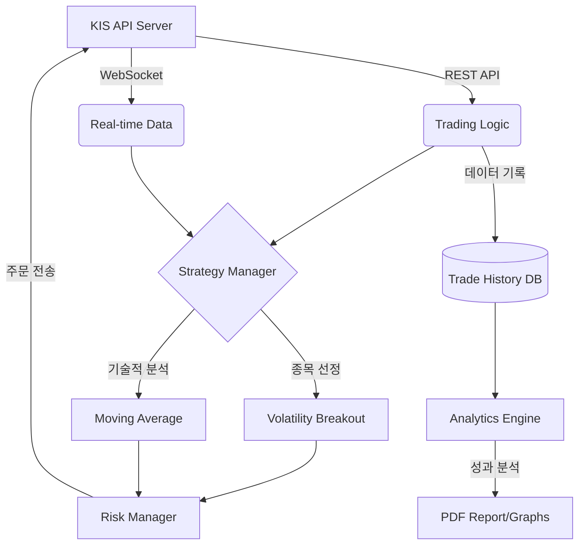
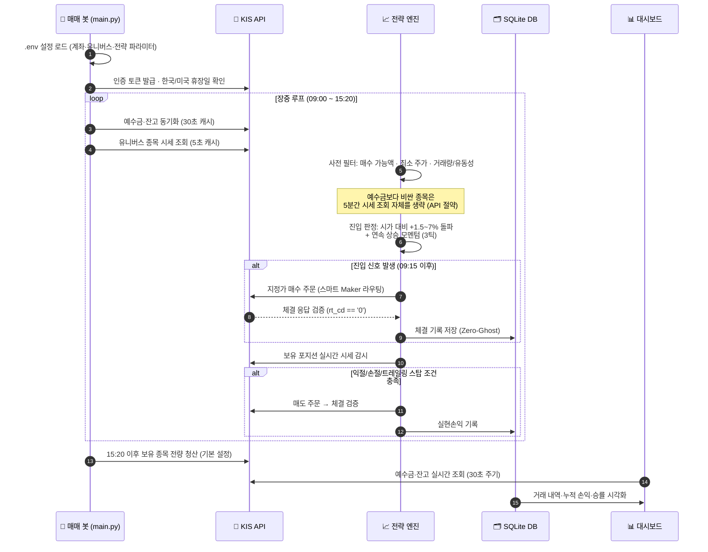

# 🏗️ 시스템 아키텍처 & 동작 원리

## 증권사별 크로스플랫폼 호환성 비교

두 운영체제(Windows/Ubuntu)를 모두 지원하려면 REST API 기반 증권사가 핵심입니다.

| 증권사 | Windows | Ubuntu | API 방식 | 실시간 시세 | 모의투자 | 난이도 |
| :--- | :---: | :---: | :--- | :---: | :---: | :---: |
| **한국투자증권** | ✅ | ✅ | **REST + WebSocket** | ✅ | ✅ | **낮음** |
| 미래에셋증권 | ✅ | ✅ | REST | ✅ | ✅ | 중간 |
| 이베스트투자증권 | ✅ | ✅ | REST | ✅ | ✅ | 중간 |
| 키움증권 | ✅ | ❌ | OCX (Windows 전용) | ✅ | ✅ | 낮음 |
| 대신증권 CYBOS | ✅ | ❌ | COM (Windows 전용) | ✅ | ❌ | 높음 |

### 🏆 한국투자증권(KIS API)을 추천하는 이유
- **크로스플랫폼**: REST API라서 Windows·Ubuntu 동일한 코드 동작
- **공식 파이썬 SDK**: `pip install kis-developers` 한 줄로 설치 및 관리 가능
- **WebSocket 실시간 시세**: 자동매매의 핵심인 실시간 호가·체결 데이터 수신
- **모의투자 서버**: 실제 자금 투입 전 완벽한 전략 검증 가능
- **활발한 커뮤니티**: 국내 자동매매 개발자들 사이에서 가장 널리 사용됨

---

## 1. 시스템 아키텍처 (System Architecture)

본 시스템은 **이벤트 기반(Event-Driven)** 설계를 통해 데이터 수신과 주문 실행 사이의 지연 시간을 최소화합니다.

## 🔄 동작 흐름 (Operation Flow)

하루 매매 사이클의 실제 동작 순서입니다. 봇은 장중(09:00~15:20)에 아래 루프를 반복하며, **실제 체결이 확인된 거래만** DB에 기록합니다.

> **핵심 원칙**
> - **1일 1회/종목**: 같은 종목은 하루 한 번만 거래하여 과도한 수수료를 방지합니다.
> - **Zero-Ghost**: KIS 주문 응답(`rt_cd == '0'`)이 검증된 실제 체결만 포지션·DB에 기록합니다.
> - **실현손익 = 거래 기록 합계**: 계좌 입금·출금은 손익에 반영되지 않습니다.
> - **API 호출 최소화**: 시세 5초·잔고 30초 캐시, 매수 불가 종목 5분 스킵, 휴장일 저전력 대기로 KIS rate limit을 보호합니다.

---

## 핵심 모듈 기능
- **Core Engine**: `kis-developers`를 이용한 한국투자증권 REST/WebSocket 통신 제어.
- **Dual-Market Engine**: 단일 봇에서 국내 주식(KOSPI/KOSDAQ) 및 미국 주식(NYSE/NASDAQ) 유니버스를 동시에 지원하고 교차 매매 수행.
- **Holiday-Aware Scheduler**: 한국(KR) 및 미국(US) 국가 공휴일을 실시간 확인하여, 휴장일에는 자동으로 거래를 멈추고 5분 단위 저전력 대기모드로 진입해 오작동 및 불필요한 API 호출을 원천 차단.
- **Zero-Ghost Trades API 검증 엔진 🛡️**: KIS API의 실제 주문 처리 응답코드(`rt_cd == '0'`)를 완벽히 검증하여, 실제 체결/접수 완료된 거래만 포지션으로 등록하고 SQLite DB에 기록하도록 개편해 허위 기록 유발을 원천 차단.
- **실시간 KIS 시세 감시 📊**: 보유 포지션 감시 및 익절/손절 시뮬레이션을 배제하고 KIS API 실시간 현재가 시세 조회(`self.broker.get_price(code)`)를 직접 연동하여 정밀하고 안정적인 리스크 관리(손절 -1.5%, 익절 +3.0%) 가동.
- **스마트 지정가 Maker 라우팅 ⚡**: Mojito의 지정가 매수/매도 API 매칭 인자(`symbol, price, quantity` 순)를 완벽히 정렬하여, 시장가 슬리피지 방지 및 Maker 수수료 혜택이 실제 계좌 상에서 작동하도록 전면 개편.
- **스마트 모멘텀 추세 전략 & 트레일링 스탑 (Extreme Growth) 📈**: 시가 대비 지정 상승률(breakout_threshold, 기본 1.5%) 돌파와 연속 상승 틱(momentum_ticks, 기본 3틱) 조건을 결합한 이중 필터 진입 시그널을 제공합니다. 진입 이후에는 최고점 대비 일정 비율(trailing_stop, 기본 1.5%) 하락 시 청산하는 트레일링 스탑 메커니즘을 적용하여 수익 보존율을 대폭 향상했습니다.
- **시장 하락장(Bear Market) 필터 🐻**: 코스피/코스닥 등 시장 대표 지수가 이동평균선 아래로 하락 추세일 때는 개별 종목 신호가 발생해도 신규 매수를 자동 중단합니다. (보유 포지션 청산은 정상 동작)
- **KIS API Rate Limit 과부하 및 오류 방지 캐시 🛡️**: `data/balance_cache.json`을 공유 파일로 활용하여 30초 단위로 예수금 및 잔고를 캐싱 및 스로틀링합니다. 또한 잔고 부족으로 매수가 불가능한 종목에 5분간의 쿨다운 경고 필터를 적용하여 API 호출 오버헤드와 로그 스팸을 완전히 차단합니다.
- **대시보드 성능 최적화 ⚡**: 대시보드의 기본 새로고침(Auto Refresh) 간격을 기존 10초에서 30초로 조정하여 불필요한 KIS API의 계좌 정보 조회 요청 횟수를 줄이고 브라우저 성능을 확보했습니다.
- **Strategy Manager**: **앙상블(Ensemble) 엔진** 탑재. 돌파, 평균회귀, 추세추종 전략의 가중 투표 방식 채택.
- **Risk Manager**: **글로벌 세이프 가드(Safe Guard)** 탑재. 나스닥 및 환율 추이에 따라 매매 비중 자동 조절.
- **Paper Trading Engine**: 실시간 호가 잔량 및 슬리피지를 반영한 정밀 가상 매매 시뮬레이터.
- **Ensemble Engine**: 전략별 실시간 성과를 추적하여 자산을 동적으로 배분.
- **Genetic Optimizer**: 유전 알고리즘을 통해 최적의 매매 파라미터($K$값 등)를 스스로 학습 및 진화하여 `.env`에 직접 업데이트 및 저장.
- **Compound Manager**: **복리 자금 관리 엔진**. 수익금을 자동으로 재투자하여 자산 성장을 가속화.
- **Volatility Filter**: 거래대금이 폭발하는 **급등 주도주** 실시간 포착 엔진.
- **AI News Analyzer**: **Google Gemini API**를 연동하여 실시간 뉴스의 호재/악재를 점수화.
- **Analytics Engine**: 샤프 지수, MDD 및 **슬리피지 비용(Slippage Cost)** 분석 및 리포팅.

---

## 탑재 전략: 변동성 돌파 (Volatility Breakout)

Larry Williams의 변동성 돌파 전략을 한국 시장에 최적화하여 구현하였습니다.

- **진입 조건**:
    - `가격 > 전일 종가 + (전일 고가 - 전일 저가) * K` (K=0.5 추천)
    - 당일 거래량 > 전일 평균 거래량 * 1.5
- **청산 조건**: 당일 장마감 직전 전량 매도 (Overnight 최소화)
- **자금 관리**: 계좌 자산의 10% 이내 분할 진입
